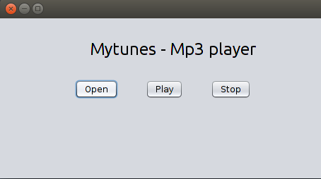

# Mp3-player
A simple mp3 player with GUI.

### Prerequisites
- JDK should be installed.
- Download the jar file from [here](http://www.javazoom.net/javalayer/sources.html)

## Compile
Before compiling,paste the jar file in: 
C:\Program Files\Java\jdk1.8.0_25\jre\lib\ext (for Windows users) 
JAVA_HOME/jre/lib/ext (for Linux users)  
compile the files using 'javac' command.

## Run
Run the files using 'java' command.

